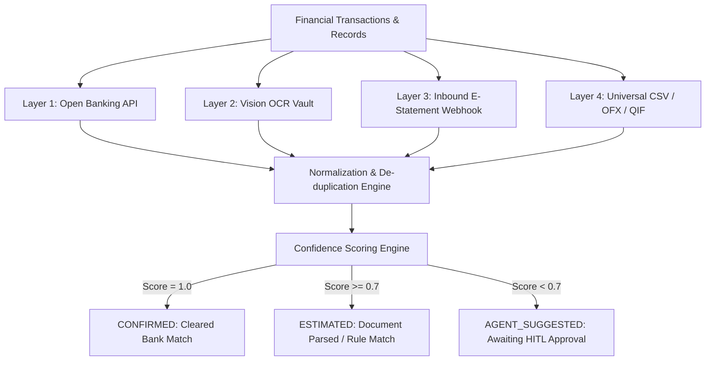
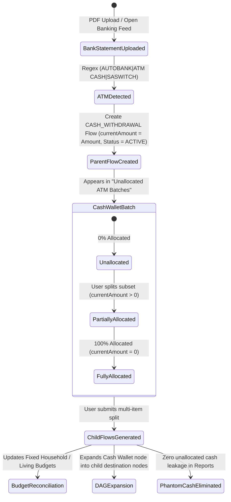

# MoneyManager — 100x Enterprise Wealth & Intelligence Operating System
## Product & Technical System Specification (v2.5 Obsidian)

---

## 1. Executive Vision & Architecture Overview

MoneyManager is engineered to transcend traditional retrospective personal finance trackers (Copilot, Monarch, YNAB, Kubera, Empower) by delivering an **Autonomous, Predictive, Multi-Entity Wealth Operating System**. 

Built with an **Obsidian Glass design philosophy**, **cooperative multi-agent AI**, **4-layer Directed Acyclic Graph (DAG) money lineage**, and **institutional-grade cashflow simulation**, MoneyManager provides end-to-end sovereignty over personal, business, and trust finances.

```
┌────────────────────────────────────────────────────────────────────────────────────────────────────────────────────────┐
│                                        MONEYMANAGER 100x ARCHITECTURE MATRIX                                           │
├──────────────────────────┬──────────────────────────┬────────────────────────────┬─────────────────────────────────────┤
│ 1. ZERO-FAILURE INGESTION│ 2. MULTI-ENTITY OFFICE   │ 3. 365-DAY NEURAL FORECAST │ 4. SOVEREIGN RAG AGENT CO-PILOT    │
├──────────────────────────┼──────────────────────────┼────────────────────────────┼─────────────────────────────────────┤
│ • Open Banking APIs      │ • Personal Wealth        │ • Daily Balance Prediction │ • 5-Year Document Vector Memory     │
│ • Vision LLM Document OCR│ • SME / Side-Hustle      │ • Monte Carlo Stress Test  │ • Cooperative Multi-Agent Swarm     │
│ • E-Statement Webhooks   │ • Property SPVs & Trusts │ • Interest & Inflow Shocks │ • BYOK (Claude, OpenAI, Gemini)     │
│ • Universal CSV/OFX Map  │ • Inter-Entity Lineage   │ • Zero-Balance Early Alerts│ • Human-In-The-Loop Review Queue    │
├──────────────────────────┼──────────────────────────┼────────────────────────────┼─────────────────────────────────────┤
│ 5. INSTITUTIONAL ASSETS  │ 6. TAX INTELLIGENCE      │ 7. LOCAL-FIRST ECOSYSTEM   │ 8. STATUTORY PAYROLL ENGINE         │
├──────────────────────────┼──────────────────────────┼────────────────────────────┼─────────────────────────────────────┤
│ • Automated Deeds Lookup │ • SARS ITR12/ITR14 Tax   │ • 0ms Local-First Sync     │ • Weekend / Holiday Auto-Shifting   │
│ • Windeed & Lightstone   │ • Section 11A / 12B Solar│ • PWA + Tauri Desktop      │ • Dual Net Margin Calculations      │
│ • XIRR / TWR Analytics   │ • 1-Click Audit PDF Pack │ • AES-256 Sovereign Data   │ • Cash Wallet Informal Subsystem    │
└──────────────────────────┴──────────────────────────┴────────────────────────────┴─────────────────────────────────────┘
```

---

## 2. The 7 Strategic Pillars & Technical Specifications

---

### Pillar 1: Zero-Failure Universal Ingestion Engine

#### 1.1 Architectural Flow


#### 1.2 Inbound E-Statement Webhook Service (`src/services/emailStatementParser.ts`)
* Users receive a unique sovereign email alias: `<username>-vault@inbound.moneymanager.local`.
* Forwarded PDF e-statements from financial institutions (FNB, Standard Bank, Nedbank, Capitec, ABSA, Investec, Discovery Bank) trigger a serverless webhook.
* Vision OCR parses transactions, extracts statement period metadata, and attaches original source PDFs into the [Document Vault](file:///c:/Ezzy/Projects/Money/src/app/documents/page.tsx).

---

### Pillar 2: Multi-Entity & Family Office Architecture

#### 2.1 Entity Hierarchy
```
┌──────────────────────────────────────────────────────────┐
│                   SOVEREIGN USER VAULT                   │
└────────────────────────────┬─────────────────────────────┘
                             │
     ┌───────────────────────┼───────────────────────┐
     ▼                       ▼                       ▼
┌──────────────┐      ┌──────────────┐      ┌──────────────┐
│   PERSONAL   │      │  OPERATING   │      │ FAMILY TRUST │
│    WEALTH    │      │  SME / PTY   │      │    / SPV     │
└──────┬───────┘      └──────┬───────┘      └──────┬───────┘
       │                     │                     │
       └──────────────┬──────┴─────────────────────┘
                      ▼
       ┌───────────────────────────────┐
       │   INTER-ENTITY DAG LINEAGE    │
       │ (Director Loans, Draws, Divs) │
       └───────────────────────────────┘
```

#### 2.2 Entity Models & Scoping
* **Personal Mode**: Salary, groceries, consumer debt, domestic sinking funds, personal investments.
* **Business / SME Mode**: Client invoicing, operational expenses, VAT provisions, contractor payroll, merchant settlements (Yoco, Ozow, PayFast, Stripe).
* **Family Trust / Holding Co Mode**: Property investments, mortgage bonds, long-term share portfolios, beneficiary distributions.
* **Inter-Entity Flow Detection**: Transfers between owned entities (e.g. `Business Cheque` $\to$ `Personal Cheque`) are tagged as `OWNER_DRAWING`, `DIRECTOR_LOAN`, or `DIVIDEND_DISTRIBUTION` without double-counting income in net worth.

---

### Pillar 3: 365-Day Neural Cashflow Simulation & Monte Carlo Engine

#### 3.1 Mathematical Formulation
For each day $t \in [1, 365]$, projected liquid balance $B(t)$ across staging accounts is modeled as:
$$B(t) = B(t-1) + \sum I_k(t) - \sum O_m(t) - \sum D_n(t) + \epsilon(t)$$
Where:
* $I_k(t)$: Projected income from source $k$ adjusted by statutory weekend/holiday shifting.
* $O_m(t)$: Fixed debit orders and recurring scheduled obligations.
* $D_n(t)$: Debt acceleration payments according to the active Snowball/Avalanche cascade.
* $\epsilon(t)$: Stochastic variance modeled from 12-month historical living spending velocity.

#### 3.2 Monte Carlo Stress Testing Scenarios
1. **Interest Rate Shock Test**: Evaluates debt servicing surge if SARB repo rate increases by $+50\text{ bps}$, $+100\text{ bps}$, or $+200\text{ bps}$.
2. **Income Disruption Test**: Simulates 30, 60, or 90-day client payment lag for self-employed/entrepreneurs.
3. **Emergency Expense Shock**: Injects random R15,000–R50,000 capital repair/medical events at random intervals to measure Emergency Reserve durability.

---

### Pillar 4: Forensic 5-Year Vector RAG Financial Memory Copilot

#### 4.1 Embeddings & Retrieval Pipeline
* **Vector Store**: pgvector extension on PostgreSQL using `DocumentChunk` and `DocumentEmbedding`.
* **Chunking Strategy**: Semantic chunking preserving financial statement tables, municipal meter reading lines, interest rates, and invoice line items.
* **Cross-Year Semantic Queries**:
  * *"What was my average municipal electricity consumption in kilowatt-hours between winter 2025 and winter 2026?"*
  * *"Find all capital improvement invoices for 42 Oak Avenue for capital gains tax offset."*
  * *"List all banking fees and instant voucher charges paid across all accounts in the last 12 months."*

---

### Pillar 5: Institutional Real Asset & Portfolio Intelligence

#### 5.1 Real Estate Automated Valuation Model (AVM)
* Integrates **Lightstone / Windeed** API connectors ([`PropertyDataConfig`](file:///c:/Ezzy/Projects/Money/prisma/schema.prisma#L306-L317)).
* Auto-fetches latest municipal valuation roll data, suburb price indexes, and deed transfer comps.
* Computes live **Loan-to-Value (LTV)** against outstanding bond balances in [`Debt`](file:///c:/Ezzy/Projects/Money/prisma/schema.prisma#L102-L131).

#### 5.2 Portfolio Analytics Engine (`src/engine/portfolioAnalytics.ts`)
* **XIRR (Extended Internal Rate of Return)**: Accurate annualized rate of return for irregular investment deposits and dividend reinvestments.
* **TWR (Time-Weighted Return)**: Measures fund manager/strategy performance independent of deposit timing.
* **Asset Allocation Drift Radar**: Real-time visualization comparing actual asset distribution vs. target policy (Equities, Bonds, Real Estate, Cash, Alternatives).

---

### Pillar 6: One-Click Tax & Audit-Proof Compliance Engine

#### 6.1 Tax Intelligence Hub (`/reports/tax`)
* **Section 11(a) General Deduction**: Aggregates verified business and freelance operational expenses.
* **Section 12B / 12BA Clean Energy Incentive**: Tracks solar PV and battery storage capital expenditure depreciation.
* **Retirement Annuity Section 11F Optimization**: Computes allowable 27.5% deduction (capped at R350,000/year) and alerts user to unused ceiling before February year-end.
* **Tax-Free Savings Account (TFSA)**: Monitors R36,000 annual limit and R500,000 lifetime ceiling to prevent 40% SARS penalty charges.
* **Audit-Proof PDF Pack Generator**: Compiles an indexed SARS ITR12 audit bundle with itemized receipts, payslips, and verified transaction hash cross-references.

---

### Pillar 7: Local-First Offline Sync & 120 FPS Cross-Platform Ecosystem

#### 7.1 Client-Side Architecture
* **Local Database**: IndexedDB / SQLite / PGlite in-browser caching for 0ms interaction response.
* **Synchronization Protocol**: Conflict-free Replicated Data Type (CRDT) sync between local client and primary PostgreSQL instance upon network reconnect.
* **Platforms**:
  * **Web & PWA**: Mobile-optimized offline Progressive Web App with WebAuthn biometrics.
  * **Desktop**: Tauri (Rust + Next.js) desktop application with global OS menu shortcuts and instant tray quick-entry.

---

### Pillar 8: ATM Withdrawal Extraction & Parent-Child Cash Split Engine

#### 8.1 Architectural Flow & State Machine


#### 8.2 Service & Entity Protocol (`cashWalletService.ts` & `MoneyFlow`)
1. **Extraction**:
   - Matches: `/(?:autobank|atm\s*cash|atm\s*w\/?d|saswitch\s*cash|cash\s*at\s*till|cash\s*withdrawal)/i`.
   - Creates parent `MoneyFlow` (`sourceType: ACCOUNT`, `destinationType: CASH_WALLET`, `flowType: CASH_WITHDRAWAL`, `originTransactionId: txn.id`).
2. **Split Protocol (`/api/cash-wallet/split`)**:
   - Input Payload:
     ```json
     {
       "parentFlowId": "flow_12345",
       "splits": [
         { "description": "Domestic Worker Wages", "category": "Domestic Worker", "amount": 950.00, "budgetCategory": "FIXED_HOUSEHOLD_OBLIGATIONS" },
         { "description": "Garden Services", "category": "Garden Services", "amount": 700.00, "budgetCategory": "FIXED_HOUSEHOLD_OBLIGATIONS" },
         { "description": "Fresh Produce Market", "category": "Groceries", "amount": 850.00, "budgetCategory": "FAMILY_AND_DISCRETIONARY" },
         { "description": "Taxi & Transport", "category": "Transport", "amount": 300.00, "budgetCategory": "FAMILY_AND_DISCRETIONARY" },
         { "description": "Parking & Car Guard Tips", "category": "Parking", "amount": 200.00, "budgetCategory": "FAMILY_AND_DISCRETIONARY" }
       ]
     }
     ```
   - Execution:
     - Verifies `sum(splits.amount) <= parentFlow.amount`.
     - Creates child `MoneyFlow` records with `parentFlowId: parentFlow.id`, `flowType: CASH_SPENDING`.
     - Updates parent `MoneyFlow.currentAmount = parentFlow.amount - sum(splits.amount)`.
     - If `currentAmount == 0`, updates parent `status = FULLY_CONSUMED`; if `currentAmount > 0`, updates `status = PARTIALLY_CONSUMED`.
3. **Downstream Budget & Lineage Propagation**:
   - Automatically synchronizes with corresponding `BudgetLineItem` records.
   - Eliminates phantom cash leakage from `/api/reports`.

---

## 3. Data Schema Extensions Specification (`prisma/schema.prisma`)

```prisma
// === MULTI-ENTITY EXTENSIONS ===
enum EntityType {
  PERSONAL
  BUSINESS
  TRUST
  SPV_PROPERTY
}

model FinancialEntity {
  id          String         @id @default(cuid())
  userId      String
  name        String
  type        EntityType     @default(PERSONAL)
  registrationNumber String?
  taxNumber   String?
  currency    String         @default("ZAR")
  isPrimary   Boolean        @default(false)
  createdAt   DateTime       @default(now())
  updatedAt   DateTime       @updatedAt
  user        User           @relation(fields: [userId], references: [id], onDelete: Cascade)
  accounts    Account[]
  assets      Asset[]
  incomes     Income[]
  budgetItems BudgetLineItem[]

  @@index([userId])
}

// === PREDICTIVE FORECAST SNAPSHOT ===
model CashflowForecast {
  id              String   @id @default(cuid())
  entityId        String
  forecastDate    DateTime
  projectedBalance Decimal
  optimisticBalance Decimal
  pessimisticBalance Decimal
  scheduledInflows Decimal
  scheduledOutflows Decimal
  riskFlags       Json?
  createdAt       DateTime @default(now())

  @@index([entityId, forecastDate])
}

// === TAX DEDUCTION ITEM ===
enum TaxCategory {
  SECTION_11A_BUSINESS_EXPENSE
  SECTION_11F_RETIREMENT_ANNUITY
  SECTION_12B_SOLAR_ENERGY
  SECTION_10_1_Q_FOREIGN_INCOME
  SECTION_6A_MEDICAL_TAX_CREDIT
  SECTION_18A_DONATION
  HOME_OFFICE
  TRAVEL_LOGBOOK
}

model TaxDeductionClaim {
  id              String       @id @default(cuid())
  entityId        String
  taxYear         Int
  category        TaxCategory
  description     String
  amount          Decimal
  documentId      String?
  transactionId   String?
  isVerified      Boolean      @default(false)
  createdAt       DateTime     @default(now())

  @@index([entityId, taxYear])
}
```

---

## 4. Cooperative AI Agent Swarm Specification

```
┌─────────────────────────────────────────────────────────────────────────────┐
│                          AGENT SWARM ORCHESTRATOR                            │
├───────────────────┬───────────────────┬───────────────────┬─────────────────┤
│  DOCUMENT AGENT   │   BUDGET AGENT    │    DEBT AGENT     │   TAX & ASSET   │
├───────────────────┼───────────────────┼───────────────────┼─────────────────┤
│ • Vision OCR scan │ • Anomaly alerts  │ • Snowball engine │ • RA/TFSA caps  │
│ • Statement sync  │ • Dual Net Margin │ • Avalanche sim   │ • Solar 12B sync│
│ • E-statement hook│ • Cash burn radar │ • Rate shock test │ • 1-Click pack  │
└───────────────────┴───────────────────┴───────────────────┴─────────────────┘
```

* **Execution Paradigm**: Deterministic math executed in TypeScript engines ([`snowball.ts`](file:///c:/Ezzy/Projects/Money/src/engine/snowball.ts), [`payrollCalendar.ts`](file:///c:/Ezzy/Projects/Money/src/lib/payrollCalendar.ts), [`financialHealthScore.ts`](file:///c:/Ezzy/Projects/Money/src/engine/financialHealthScore.ts)), with LLM agents handling semantic translation, document synthesis, and human-in-the-loop proposals.
* **Privacy Boundary**: Financial account numbers, personal IDs, and sensitive tokens are masked client-side before any LLM inference call.

---

## 5. Phased Implementation Milestones

| Milestone | Target Horizon | Deliverables |
| :--- | :--- | :--- |
| **Phase 1: Ingestion & 365-Day Foresight** | Q1 | Inbound e-statement parser, 365-day balance projection canvas, Stitch/Plaid hybrid open-banking layer |
| **Phase 2: Multi-Entity & Tax Intelligence** | Q2 | Multi-Entity workspace switcher (Personal/SME/Trust), SARS/IRS tax deduction engine, 1-click audit pack export |
| **Phase 3: RAG Memory & Asset Automation** | Q3 | 5-Year vector semantic document Q&A, Lightstone deeds API, TransUnion vehicle depreciation curves, XIRR/TWR portfolio drift |
| **Phase 4: Local-First & Ecosystem** | Q4 | PGlite/IndexedDB local-first synchronization, Tauri native desktop apps for Mac/Windows, biometric PWA |

---

*MoneyManager Specification v2.0 — Approved for Implementation.*
