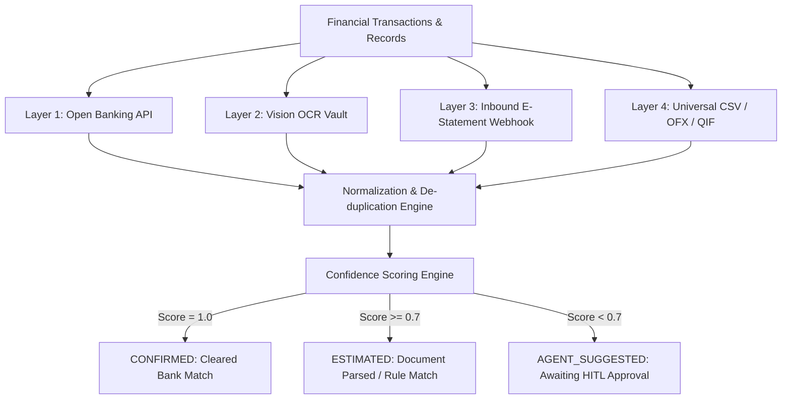
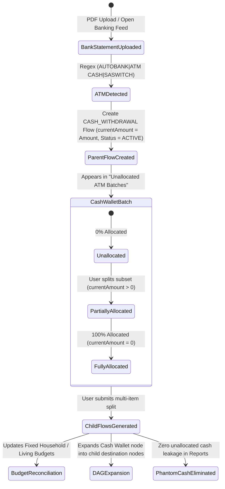
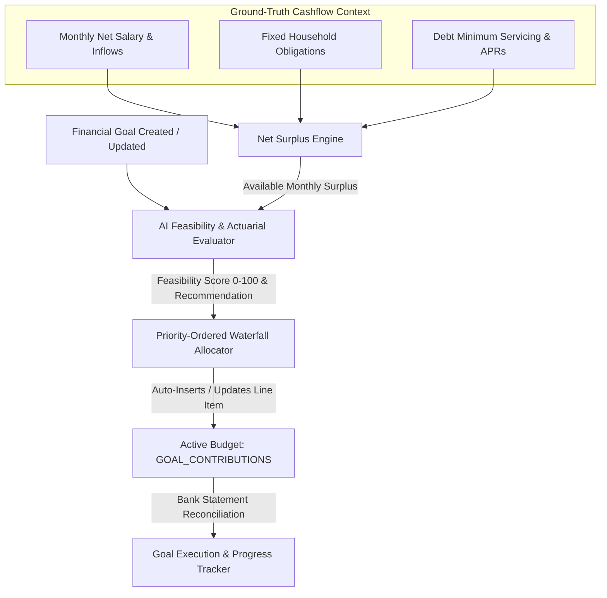
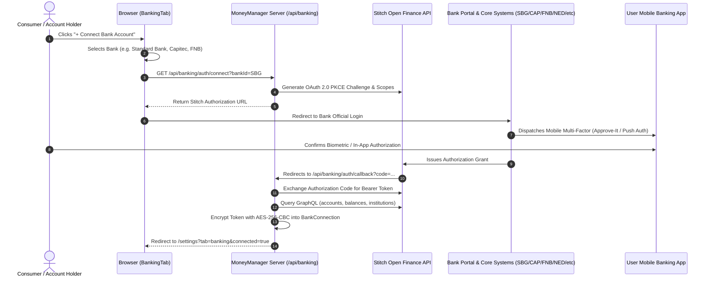

# MoneyManager — 100x Enterprise Wealth & Intelligence Operating System
## Product & Technical System Specification (v2.5 Obsidian)

---

## 1. Executive Vision & Architecture Overview

MoneyManager is engineered to transcend traditional retrospective personal finance trackers (Copilot, Monarch, YNAB, Kubera, Empower) by delivering an **Autonomous, Predictive, Multi-Entity Wealth Operating System**. 

Built with an **Obsidian Glass design philosophy**, **cooperative multi-agent AI**, **4-layer Directed Acyclic Graph (DAG) money lineage**, and **institutional-grade cashflow simulation**, MoneyManager provides end-to-end sovereignty over personal, business, and trust finances.

```
┌────────────────────────────────────────────────────────────────────────────────────────────────────────────────────────┐
│                                        MONEYMANAGER 100x ARCHITECTURE MATRIX                                           │
├──────────────────────────┬──────────────────────────┬────────────────────────────┬─────────────────────────────────────┤
│ 1. ZERO-FAILURE INGESTION│ 2. MULTI-ENTITY OFFICE   │ 3. 365-DAY NEURAL FORECAST │ 4. SOVEREIGN RAG AGENT CO-PILOT    │
├──────────────────────────┼──────────────────────────┼────────────────────────────┼─────────────────────────────────────┤
│ • Open Banking APIs      │ • Personal Wealth        │ • Daily Balance Prediction │ • 5-Year Document Vector Memory     │
│ • Vision LLM Document OCR│ • SME / Side-Hustle      │ • Monte Carlo Stress Test  │ • Cooperative Multi-Agent Swarm     │
│ • E-Statement Webhooks   │ • Property SPVs & Trusts │ • Interest & Inflow Shocks │ • BYOK (Claude, OpenAI, Gemini)     │
│ • Universal CSV/OFX Map  │ • Inter-Entity Lineage   │ • Zero-Balance Early Alerts│ • Human-In-The-Loop Review Queue    │
├──────────────────────────┼──────────────────────────┼────────────────────────────┼─────────────────────────────────────┤
│ 5. INSTITUTIONAL ASSETS  │ 6. TAX INTELLIGENCE      │ 7. LOCAL-FIRST ECOSYSTEM   │ 8. STATUTORY PAYROLL ENGINE         │
├──────────────────────────┼──────────────────────────┼────────────────────────────┼─────────────────────────────────────┤
│ • Automated Deeds Lookup │ • SARS ITR12/ITR14 Tax   │ • 0ms Local-First Sync     │ • Weekend / Holiday Auto-Shifting   │
│ • Windeed & Lightstone   │ • Section 11A / 12B Solar│ • PWA + Tauri Desktop      │ • Dual Net Margin Calculations      │
│ • XIRR / TWR Analytics   │ • 1-Click Audit PDF Pack │ • AES-256 Sovereign Data   │ • Cash Wallet Informal Subsystem    │
└──────────────────────────┴──────────────────────────┴────────────────────────────┴─────────────────────────────────────┘
```

---

## 2. Strategic Pillars & Technical Specifications

---

### Pillar 1: Zero-Failure Universal Ingestion Engine

#### 1.1 Architectural Flow


#### 1.2 Inbound E-Statement Webhook Service (`src/services/emailStatementParser.ts`)
* Users receive a unique sovereign email alias: `<username>-vault@inbound.moneymanager.local`.
* Forwarded PDF e-statements from financial institutions (FNB, Standard Bank, Nedbank, Capitec, ABSA, Investec, Discovery Bank) trigger a serverless webhook.
* Vision OCR parses transactions, extracts statement period metadata, and attaches original source PDFs into the [Document Vault](file:///c:/Ezzy/Projects/Money/src/app/documents/page.tsx).

---

### Pillar 2: Multi-Entity & Family Office Architecture

#### 2.1 Entity Hierarchy
```
┌──────────────────────────────────────────────────────────┐
│                   SOVEREIGN USER VAULT                   │
└────────────────────────────┬─────────────────────────────┘
                             │
     ┌───────────────────────┼───────────────────────┐
     ▼                       ▼                       ▼
┌──────────────┐      ┌──────────────┐      ┌──────────────┐
│   PERSONAL   │      │  OPERATING   │      │ FAMILY TRUST │
│    WEALTH    │      │  SME / PTY   │      │    / SPV     │
└──────┬───────┘      └──────┬───────┘      └──────┬───────┘
       │                     │                     │
       └──────────────┬──────┴─────────────────────┘
                      ▼
       ┌───────────────────────────────┐
       │   INTER-ENTITY DAG LINEAGE    │
       │ (Director Loans, Draws, Divs) │
       └───────────────────────────────┘
```

#### 2.2 Entity Models & Scoping
* **Personal Mode**: Salary, groceries, consumer debt, domestic sinking funds, personal investments.
* **Business / SME Mode**: Client invoicing, operational expenses, VAT provisions, contractor payroll, merchant settlements (Yoco, Ozow, PayFast, Stripe).
* **Family Trust / Holding Co Mode**: Property investments, mortgage bonds, long-term share portfolios, beneficiary distributions.
* **Inter-Entity Flow Detection**: Transfers between owned entities (e.g. `Business Cheque` $\to$ `Personal Cheque`) are tagged as `OWNER_DRAWING`, `DIRECTOR_LOAN`, or `DIVIDEND_DISTRIBUTION` without double-counting income in net worth.

---

### Pillar 3: 365-Day Neural Cashflow Simulation & Monte Carlo Engine

#### 3.1 Mathematical Formulation
For each day $t \in [1, 365]$, projected liquid balance $B(t)$ across staging accounts is modeled as:
$$B(t) = B(t-1) + \sum I_k(t) - \sum O_m(t) - \sum D_n(t) + \epsilon(t)$$
Where:
* $I_k(t)$: Projected income from source $k$ adjusted by statutory weekend/holiday shifting.
* $O_m(t)$: Fixed debit orders and recurring scheduled obligations.
* $D_n(t)$: Debt acceleration payments according to the active Snowball/Avalanche cascade.
* $\epsilon(t)$: Stochastic variance modeled from 12-month historical living spending velocity.

#### 3.2 Monte Carlo Stress Testing Scenarios
1. **Interest Rate Shock Test**: Evaluates debt servicing surge if SARB repo rate increases by $+50\text{ bps}$, $+100\text{ bps}$, or $+200\text{ bps}$.
2. **Income Disruption Test**: Simulates 30, 60, or 90-day client payment lag for self-employed/entrepreneurs.
3. **Emergency Expense Shock**: Injects random R15,000–R50,000 capital repair/medical events at random intervals to measure Emergency Reserve durability.

---

### Pillar 4: Forensic 5-Year Vector RAG Financial Memory Copilot

#### 4.1 Embeddings & Retrieval Pipeline
* **Vector Store**: pgvector extension on PostgreSQL using `DocumentChunk` and `DocumentEmbedding`.
* **Chunking Strategy**: Semantic chunking preserving financial statement tables, municipal meter reading lines, interest rates, and invoice line items.
* **Cross-Year Semantic Queries**:
  * *"What was my average municipal electricity consumption in kilowatt-hours between winter 2025 and winter 2026?"*
  * *"Find all capital improvement invoices for 42 Oak Avenue for capital gains tax offset."*
  * *"List all banking fees and instant voucher charges paid across all accounts in the last 12 months."*

---

### Pillar 5: Institutional Real Asset & Portfolio Intelligence

#### 5.1 Real Estate Automated Valuation Model (AVM)
* Integrates **Lightstone / Windeed** API connectors ([`PropertyDataConfig`](file:///c:/Ezzy/Projects/Money/prisma/schema.prisma#L306-L317)).
* Auto-fetches latest municipal valuation roll data, suburb price indexes, and deed transfer comps.
* Computes live **Loan-to-Value (LTV)** against outstanding bond balances in [`Debt`](file:///c:/Ezzy/Projects/Money/prisma/schema.prisma#L102-L131).

#### 5.2 Portfolio Analytics Engine (`src/engine/portfolioAnalytics.ts`)
* **XIRR (Extended Internal Rate of Return)**: Accurate annualized rate of return for irregular investment deposits and dividend reinvestments.
* **TWR (Time-Weighted Return)**: Measures fund manager/strategy performance independent of deposit timing.
* **Asset Allocation Drift Radar**: Real-time visualization comparing actual asset distribution vs. target policy (Equities, Bonds, Real Estate, Cash, Alternatives).

---

### Pillar 6: One-Click Tax & Audit-Proof Compliance Engine

#### 6.1 Tax Intelligence Hub (`/reports/tax`)
* **Section 11(a) General Deduction**: Aggregates verified business and freelance operational expenses.
* **Section 12B / 12BA Clean Energy Incentive**: Tracks solar PV and battery storage capital expenditure depreciation.
* **Retirement Annuity Section 11F Optimization**: Computes allowable 27.5% deduction (capped at R350,000/year) and alerts user to unused ceiling before February year-end.
* **Tax-Free Savings Account (TFSA)**: Monitors R36,000 annual limit and R500,000 lifetime ceiling to prevent 40% SARS penalty charges.
* **Audit-Proof PDF Pack Generator**: Compiles an indexed SARS ITR12 audit bundle with itemized receipts, payslips, and verified transaction hash cross-references.

---

### Pillar 7: Local-First Offline Sync & 120 FPS Cross-Platform Ecosystem

#### 7.1 Client-Side Architecture
* **Local Database**: IndexedDB / SQLite / PGlite in-browser caching for 0ms interaction response.
* **Synchronization Protocol**: Conflict-free Replicated Data Type (CRDT) sync between local client and primary PostgreSQL instance upon network reconnect.
* **Platforms**:
  * **Web & PWA**: Mobile-optimized offline Progressive Web App with WebAuthn biometrics.
  * **Desktop**: Tauri (Rust + Next.js) desktop application with global OS menu shortcuts and instant tray quick-entry.

---

### Pillar 8: ATM Withdrawal Extraction & Parent-Child Cash Split Engine

#### 8.1 Architectural Flow & State Machine


#### 8.2 Service & Entity Protocol (`cashWalletService.ts` & `MoneyFlow`)
1. **Extraction**:
   - Matches: `/(?:autobank|atm\s*cash|atm\s*w\/?d|saswitch\s*cash|cash\s*at\s*till|cash\s*withdrawal)/i`.
   - Creates parent `MoneyFlow` (`sourceType: ACCOUNT`, `destinationType: CASH_WALLET`, `flowType: CASH_WITHDRAWAL`, `originTransactionId: txn.id`).
2. **Split Protocol (`/api/cash-wallet/split`)**:
   - Input Payload:
     ```json
     {
       "parentFlowId": "flow_12345",
       "splits": [
         { "description": "Domestic Worker Wages", "category": "Domestic Worker", "amount": 950.00, "budgetCategory": "FIXED_HOUSEHOLD_OBLIGATIONS" },
         { "description": "Garden Services", "category": "Garden Services", "amount": 700.00, "budgetCategory": "FIXED_HOUSEHOLD_OBLIGATIONS" },
         { "description": "Fresh Produce Market", "category": "Groceries", "amount": 850.00, "budgetCategory": "FAMILY_AND_DISCRETIONARY" },
         { "description": "Taxi & Transport", "category": "Transport", "amount": 300.00, "budgetCategory": "FAMILY_AND_DISCRETIONARY" },
         { "description": "Parking & Car Guard Tips", "category": "Parking", "amount": 200.00, "budgetCategory": "FAMILY_AND_DISCRETIONARY" }
       ]
     }
     ```
   - Execution:
     - Verifies `sum(splits.amount) <= parentFlow.amount`.
     - Creates child `MoneyFlow` records with `parentFlowId: parentFlow.id`, `flowType: CASH_SPENDING`.
     - Updates parent `MoneyFlow.currentAmount = parentFlow.amount - sum(splits.amount)`.
     - If `currentAmount == 0`, updates parent `status = FULLY_CONSUMED`; if `currentAmount > 0`, updates `status = PARTIALLY_CONSUMED`.
3. **Downstream Budget & Lineage Propagation**:
    - Automatically synchronizes with corresponding `BudgetLineItem` records.
    - Eliminates phantom cash leakage from `/api/reports`.

---

### Pillar 9: Dynamic Goal-to-Budget Linking & AI Feasibility Engine (`src/lib/goalBudgetSync.ts`, `src/agents/goalsAgent.ts`)

#### 9.1 Architectural Flow


#### 9.2 Key Capabilities
* **Multi-Agent Actuarial Evaluator**: Evaluates goal viability against the user's ground-truth cashflow, flagging high-interest debt drags (>15% APR) vs investment returns, safety buffers, and time horizons.
* **Priority Waterfall Allocation**: When `autoAllocateSurplus` is enabled, the system allocates available monthly cash surplus to goals sequentially based on priority rank (e.g. Priority 1 Emergency Reserve first).
* **Two-Way Synchronization**: Automatically maintains `BudgetLineItem` records under `category: "GOAL_CONTRIBUTIONS"` with `sourceRef: "goal:<id>"`.

---

---

### Pillar 10: South African Open Banking, Administrator Gateway & Inbound Scanner Hub (`/settings?tab=banking` & `/settings?tab=admin-gateway`)

#### 10.1 Architecture & OAuth 2.0 PKCE Flow


#### 10.2 Architectural Pillars & Security Invariants
* **Multi-Bank Neutrality (`FIX-022`)**:
  - Native support for all 8 major South African commercial banking institutions: Standard Bank (`SBG`), Capitec (`CAP`), First National Bank (`FNB`), Nedbank (`NED`), Investec (`INV`), Absa (`ABSA`), Discovery Bank (`DISC`), and TymeBank (`TYME`).
  - Strict neutrality across institutions without proprietary third-party lock-ins or hardcoded vendor recommendations.
* **Administrator Role Segregation (`FIX-023`)**:
  - **Administrator Gateway Hub (`/settings?tab=admin-gateway`)**: System infrastructure configuration (`STITCH_CLIENT_ID`, `STITCH_CLIENT_SECRET`, and redirect URIs) is restricted to users with `role: "admin"`.
  - **Backend Role-Based Access Control**: `POST /api/banking/config` verifies administrator privileges and rejects non-admin requests with `403 Forbidden`. `GET /api/banking/config` returns `{ isConfigured: boolean }` to standard users without leaking masked secrets.
  - **Clean Consumer Experience**: Standard consumers at `/settings?tab=banking` are presented with an intuitive, non-technical bank connection flow free of infrastructure API credentials.
* **Zero-Mock Policy & Ground-Truth Invariant (`FIX-021`)**:
  - Prohibits synthetic fallback data generators (`generateSandboxBankData` deleted).
  - Physical decoupling of uploaded PDF statement records (`Document`) from live API connections (`BankConnection`).
  - Live API errors strictly bubble up to inform the user when authentication or connectivity requires attention.
* **Hybrid Statement Scanner (`EmailScannerHub`)**:
  - Inbound IMAP email scanner automatically captures e-statements, municipal utility rates, and telco invoices directly from financial institutions.

---

### Pillar 11: South African Statutory Salary & Increase Intelligence Engine (`src/engine/salaryCalculator.ts`, `/salary-calculator`)

#### 11.1 Statutory Tax Formulation (SARS 2026/2027)
Net salary calculation incorporates full South African statutory tax tables and pre-tax deductions:
$$\text{Taxable Income} = \text{Gross Salary} - \min(\text{Retirement Contribution}, 0.275 \times \text{Gross}, \text{R 350,000 / yr})$$
$$\text{PAYE Liability} = \text{TaxBracket}(\text{Taxable Income}) - \text{Primary Rebate (R 17,235)} - \text{Section 6A Medical Credits}$$
$$\text{UIF Contribution} = \min(0.01 \times \text{Gross}, \text{R 177.12 / mo})$$
$$\text{Net Take-Home Pay} = \text{Gross} - \text{PAYE} - \text{UIF} - \text{Medical Aid} - \text{Retirement} - \text{Other Deductions}$$

#### 11.2 Key Capabilities & Simulation
* **Section 6A Medical Scheme Fees Tax Credits**: R 364/mo for the primary member, R 364/mo for the first dependant, and R 246/mo for each additional dependant.
* **Marginal Bracket Creep Analysis**: Visualizes when an incremental notch increase pushes portions of income into higher marginal tax brackets (up to 45%).
* **Retroactive Lump-Sum Backpay Simulator**: Models backdated pay increases over 1 to 12 months, calculating accumulated gross backpay, statutory tax withholdings, and net liquid windfall for debt acceleration.
* **Sinking Fund Cashflow Rebalance (`FIX-020`)**: Synchronizes verified net salary increases (e.g. R 74,438.26) directly into forward budget surplus and sinking fund allocations.

---

## 3. Data Schema Extensions Specification (`prisma/schema.prisma`)

```prisma
// === MULTI-ENTITY EXTENSIONS ===
enum EntityType {
  PERSONAL
  BUSINESS
  TRUST
  SPV_PROPERTY
}

model FinancialEntity {
  id          String         @id @default(cuid())
  userId      String
  name        String
  type        EntityType     @default(PERSONAL)
  registrationNumber String?
  taxNumber   String?
  currency    String         @default("ZAR")
  isPrimary   Boolean        @default(false)
  createdAt   DateTime       @default(now())
  updatedAt   DateTime       @updatedAt
  user        User           @relation(fields: [userId], references: [id], onDelete: Cascade)
  accounts    Account[]
  assets      Asset[]
  incomes     Income[]
  budgetItems BudgetLineItem[]

  @@index([userId])
}

// === PREDICTIVE FORECAST SNAPSHOT ===
model CashflowForecast {
  id              String   @id @default(cuid())
  entityId        String
  forecastDate    DateTime
  projectedBalance Decimal
  optimisticBalance Decimal
  pessimisticBalance Decimal
  scheduledInflows Decimal
  scheduledOutflows Decimal
  riskFlags       Json?
  createdAt       DateTime @default(now())

  @@index([entityId, forecastDate])
}

// === TAX DEDUCTION ITEM ===
enum TaxCategory {
  SECTION_11A_BUSINESS_EXPENSE
  SECTION_11F_RETIREMENT_ANNUITY
  SECTION_12B_SOLAR_ENERGY
  SECTION_10_1_Q_FOREIGN_INCOME
  SECTION_6A_MEDICAL_TAX_CREDIT
  SECTION_18A_DONATION
  HOME_OFFICE
  TRAVEL_LOGBOOK
}

model TaxDeductionClaim {
  id              String       @id @default(cuid())
  entityId        String
  taxYear         Int
  category        TaxCategory
  description     String
  amount          Decimal
  documentId      String?
  transactionId   String?
  isVerified      Boolean      @default(false)
  createdAt       DateTime     @default(now())

  @@index([entityId, taxYear])
}
```

---

## 4. Cooperative AI Agent Swarm Specification

```
┌─────────────────────────────────────────────────────────────────────────────┐
│                          AGENT SWARM ORCHESTRATOR                            │
├───────────────────┬───────────────────┬───────────────────┬─────────────────┤
│  DOCUMENT AGENT   │   BUDGET AGENT    │    DEBT AGENT     │   TAX & ASSET   │
├───────────────────┼───────────────────┼───────────────────┼─────────────────┤
│ • Vision OCR scan │ • Anomaly alerts  │ • Snowball engine │ • RA/TFSA caps  │
│ • Statement sync  │ • Dual Net Margin │ • Avalanche sim   │ • Solar 12B sync│
│ • E-statement hook│ • Cash burn radar │ • Rate shock test │ • 1-Click pack  │
└───────────────────┴───────────────────┴───────────────────┴─────────────────┘
```

* **Execution Paradigm**: Deterministic math executed in TypeScript engines ([`snowball.ts`](file:///c:/Ezzy/Projects/Money/src/engine/snowball.ts), [`payrollCalendar.ts`](file:///c:/Ezzy/Projects/Money/src/lib/payrollCalendar.ts), [`financialHealthScore.ts`](file:///c:/Ezzy/Projects/Money/src/engine/financialHealthScore.ts)), with LLM agents handling semantic translation, document synthesis, and human-in-the-loop proposals.
* **Privacy Boundary**: Financial account numbers, personal IDs, and sensitive tokens are masked client-side before any LLM inference call.

---

---

## 5. Enterprise Admin Portal & Root Governance Layer

```
┌─────────────────────────────────────────────────────────────────────────────┐
│                       ROOT GOVERNANCE & TELEMETRY                           │
├───────────────────┬───────────────────┬───────────────────┬─────────────────┤
│  IDENTITY & ROLES │ PAYMENT GATEWAYS  │ MACRO TELEMETRY   │ CRYPTO HEALTH   │
├───────────────────┼───────────────────┼───────────────────┼─────────────────┤
│ • User Directory  │ • PayFast SA      │ • Ingested Volume │ • AES-256 Vault │
│ • Role Switcher   │ • Peach Payments  │ • Document Counts │ • HMAC Signer   │
│ • Tier Overrides  │ • Ozow Instant EFT│ • MRR Run-Rate    │ • Webhook Secret│
│ • Profile Updates │ • FICA Settlement │ • Account Counts  │ • Open Banking  │
└───────────────────┴───────────────────┴───────────────────┴─────────────────┘
```

* **Role-Based Access Control (RBAC)**: Strict `admin` authorization gating for `/admin` routes and `/api/admin/*` endpoints.
* **Payment Settlement Integrity**: Enforces strict FICA validation on linked corporate settlement bank accounts (rejecting unverified/crypto accounts).

---

---

## 7. Continuous Multi-Agent Learning & Feedback Flywheel

```
┌────────────────────────────────────────────────────────────────────────────────────────┐
│                      CONTINUOUS AGENT LEARNING & FEEDBACK FLYWHEEL                     │
├──────────────────────────┬──────────────────────────┬──────────────────────────────────┤
│ 1. REAL-TIME INPUTS      │ 2. AGENT MEMORY STORE    │ 3. DYNAMIC PROMPT AUGMENTATION   │
├──────────────────────────┼──────────────────────────┼──────────────────────────────────┤
│ • Pin Calibrations       │ • UserAgentMemory Schema │ • Few-Shot Prompt Prepending     │
│ • Rebrandings (Astron)   │ • Key-Value Pattern Store│ • Zero-Latency Disambiguation    │
│ • Category Adjustments   │ • Confidence Scoring (0-1│ • Elimination of Old Mistakes    │
│ • HITL Accept/Reject     │ • Usage Frequency Counter│ • Contextual Risk Optimization   │
└──────────────────────────┴──────────────────────────┴──────────────────────────────────┘
```

### 7.1 Architecture & Schema (`UserAgentMemory`)
Agents evolve from stateless executors into self-reinforcing financial intelligences by maintaining long-term memory across 6 specialized domains:
* `GEO`: Geotagged merchant aliases, physical venue mappings, and coordinate calibrations (e.g. `SEASON AND SPAR` $\rightarrow$ `Seasons Sport & Spa Resort, Hartbeespoort (North West)`).
* `BUDGET`: Salary payment dates, mid-month weekend shifting rules, and discretionary spending margins.
* `DEBT`: Priority debt acceleration preferences (e.g. accelerating municipal utility arrears before lower-risk obligations).
* `GOALS`: Emergency fund targets, risk buffers, and savings thresholds.
* `DOCUMENT`: Statement structure patterns, transaction descriptor formats, and institution-specific extraction rules.
* `PREFERENCE`: General user behavioral rules, communication tone, and decision rationale.

### 7.2 In-Context Dynamic Augmentation
Prior to executing inference on any LLM provider (Google Gemini 3.7 Flash, Anthropic Claude 3.5 Sonnet, OpenAI GPT-4o), the system queries `getPromptAugmentationMemories` and injects verified learned rules directly into the agent's system prompt:

```markdown
### 🧠 Continuous Multi-Agent Learned Memories & User Corrections (DO NOT REPEAT OLD MISTAKES):
1. [GEO] Pattern: "SEASON AND SPAR" -> Correct Interpretation: Seasons Sport & Spa Resort in Hartbeespoort (North West)
2. [GEO] Pattern: "ENGEN BAKERTON" -> Correct Interpretation: Rebranded to Astron Energy Welgedacht Rd & 3rd Ave
3. [BUDGET] Pattern: "PRIMARY_PAY_CYCLE" -> Correct Interpretation: Mid-Month 15th to 15th Salary Cycle
```

### 7.3 Apple-Grade Memory Management Interface (`src/components/AgentMemoryManager.tsx`, `FIX-024`)
The Continuous Agent Learning hub (`/settings?tab=agent-memory`) provides an obsidian control console adhering to Apple-caliber aesthetic standards:
* **Metric Grid Overview**:
  - Displays 4 key health cards: *Active Memory Rules*, *High Confidence Rules ($\ge 0.8$)*, *Average Rule Confidence*, and *Active Domains Count*.
* **Interactive Domain Filters & Live Counts**:
  - Real-time segmented pill filters (`ALL`, `GEO`, `BUDGET`, `DEBT`, `GOALS`, `DOCUMENT`, `PREFERENCE`) showing matching memory counts per domain.
* **Granular Rule Inspection & Governance**:
  - Individual memory cards show trigger pattern, exact agent instruction, confidence badge, usage counter, and creation timestamp. Users can delete obsolete or conflicting rules with instant UI updates.
* **Custom Rule Authoring Modal**:
  - A glassmorphic modal allows direct authoring of domain rules, pattern triggers, instructions, and confidence scores (0.1–1.0) with immediate synchronization to PostgreSQL `UserAgentMemory`.

---

## 8. Phased Implementation Milestones

| Milestone | Target Horizon | Deliverables |
| :--- | :--- | :--- |
| **Phase 1: Ingestion & 365-Day Foresight** | Q1 | Inbound e-statement parser, 365-day balance projection canvas, Stitch live Open Finance PKCE layer |
| **Phase 2: Multi-Entity & Tax Intelligence** | Q2 | Multi-Entity workspace switcher (Personal/SME/Trust), SARS statutory tax & salary increase calculator, 1-click audit pack export |
| **Phase 3: RAG Memory & Asset Automation** | Q3 | 5-Year vector semantic document Q&A, Lightstone deeds API, TransUnion vehicle depreciation curves, XIRR/TWR portfolio drift |
| **Phase 4: Continuous Agent Learning & Admin** | Q4 | Continuous Agent Memory Flywheel, Enterprise Admin Portal (/admin), Administrator Open Finance Gateway (/settings?tab=admin-gateway), 21-test Vitest regression engine |

---

*MoneyManager Specification v2.6 Obsidian — Approved for Implementation.*
